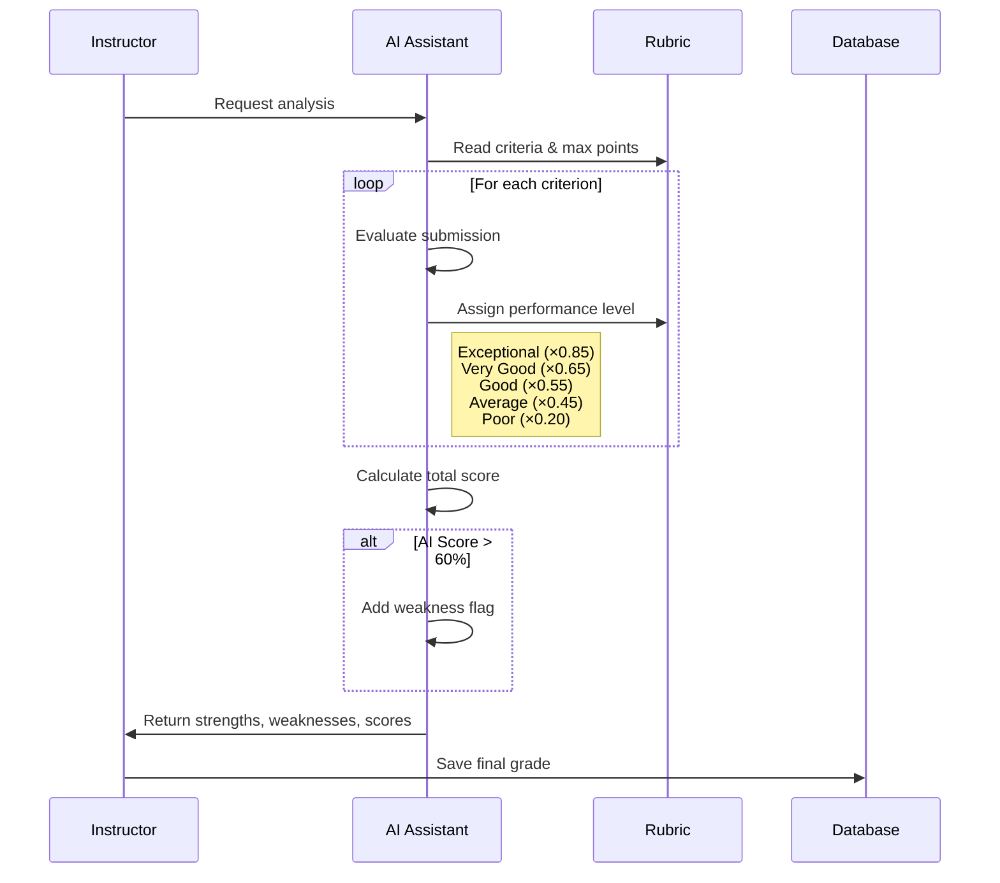

# Grading & AI Teaching Assistant

## Overview

Schologic provides AI-powered grading assistance to help you:
- Analyze submissions for strengths and weaknesses
- Apply rubric criteria consistently
- Save time on repetitive grading tasks

---

## Viewing Submissions

### Steps to Access Submissions

1. **Navigate to Assignment**
   - Open your class
   - Go to **Assignments** tab
   - Click on the assignment

2. **View Submission List**
   - See all student submissions
   - Each shows: name, time, AI score, status

3. **Open a Submission**
   - Click on a student's submission
   - Full submission view opens

### Submission View Components

| Component | Description |
|-----------|-------------|
| **Student Info** | Name, registration number |
| **Submission Text** | Full submitted content |
| **AI Score** | Global AI detection score |
| **Segment Breakdown** | Paragraph-by-paragraph AI analysis |
| **Rubric** | Grading criteria (if configured) |
| **Grade Input** | Where you enter the final grade |

---

## Using the AI Teaching Assistant

### What the AI Assistant Provides

When you request AI analysis of a submission, it generates:

1. **Strengths** (2+ points)
   - Positive observations about the work
   - What the student did well
   - Short bullet points (7-12 words each)

2. **Weaknesses** (2+ points)
   - Areas for improvement
   - What's missing or needs work
   - Short bullet points (7-12 words each)

3. **Rubric Breakdown**
   - Score for each criterion
   - Performance level (Exceptional to Poor)
   - Brief reasoning (4-6 words each)

4. **Suggested Grade**
   - Calculated total from rubric scores
   - Based on deterministic multipliers

### Steps to Use AI Assistant

1. **Open a Submission**
   - Navigate to the submission you want to grade

2. **Click AI Insights / Analyze**
   - Look for the **AI Insights** or sparkle (✨) button
   - AI analysis begins

3. **Wait for Results**
   - Processing takes a few seconds
   - Results appear in a panel or modal

4. **Review the Analysis**
   - Read strengths and weaknesses
   - Check rubric breakdown scores
   - Note the suggested grade

5. **Use as Reference**
   - Modify scores as needed
   - Add your own feedback
   - Enter final grade

---

## Grading Logic Explained

### How AI Grades Are Calculated

The AI Teaching Assistant uses a deterministic scoring system:

### Performance Level Multipliers

| Level | Multiplier | Meaning |
|-------|------------|---------|
| **Exceptional** | ×0.85 | Outstanding; exceeds all requirements |
| **Very Good** | ×0.65 | Strong; very few minor errors |
| **Good** | ×0.55 | Satisfactory; meets most requirements |
| **Average** | ×0.45 | Basic; significant gaps |
| **Poor** | ×0.20 | Fail; does not meet minimums |

### Example Calculation

**Rubric:**
- Thesis (30 points max)
- Evidence (25 points max)  
- Analysis (25 points max)
- Writing (20 points max)

**AI Assessment:**
- Thesis: Very Good → 30 × 0.65 = 20 points
- Evidence: Exceptional → 25 × 0.85 = 21 points
- Analysis: Good → 25 × 0.55 = 14 points
- Writing: Average → 20 × 0.45 = 9 points

**Total: 64 points out of 100**

---

## Manual Grading

### Entering Grades

1. **Open Submission**
   - Navigate to the submission

2. **Find Grade Input**
   - Usually a number field

3. **Enter Score**
   - Type the grade value
   - Or use AI suggestion as starting point

4. **Add Feedback** (Optional)
   - Written comments for student
   - Constructive suggestions

5. **Save Grade**
   - Click **Save** or **Submit Grade**
   - Grade recorded to database

---

## Grades Table

### Accessing the Grades Table

1. Open your class
2. Click **Grades** tab
3. View all students and their grades

### Table Features

| Feature | How to Use |
|---------|------------|
| **Search** | Type name or registration number |
| **Sort by Name** | Click column header (A-Z, Z-A) |
| **Sort by Score** | Click to sort high-to-low or low-to-high |
| **Sort by AI Score** | See highest or lowest AI scores |
| **Filter: All** | Show all students |
| **Filter: Passing** | Students above pass threshold |
| **Filter: Failing** | Students below pass threshold |
| **Filter: Needs Grading** | Ungraded submissions only |

### Grade Columns

- Student registration number
- Student name
- Individual assignment grades
- Total percentage
- Average AI score

---

## Exporting Grades

### Steps to Export

1. **Go to Grades Tab**
   - Open your class
   - Click **Grades**

2. **Click Export to PDF**
   - Button in top-right area
   - PDF generates and downloads

### PDF Contents

- Class name and date
- All enrolled students
- Grade for each assignment
- Total score and percentage
- AI score averages
- Summary statistics

---

## Grading Tips

### Using AI as a Starting Point

1. Run AI analysis first
2. Review suggested scores
3. Adjust based on your expertise
4. Add personal feedback

### Handling High AI Scores

When AI Score > 60%:
- AI Assistant automatically flags in weaknesses
- Review submission carefully
- Consider discussion with student
- Document your decision

### Consistent Grading

- Use rubrics for all assignments
- Apply same criteria to all students
- AI multipliers ensure consistency
- Override only when justified

---

## Next Steps

- [Assignments & Quizzes](./06-assignments-quizzes.md) - Create rubrics
- [AI Detection](./04-ai-detection.md) - Understand AI scores
- [Student Workflows](./12-student-workflows.md) - What students see
