# Resource Library

## Overview

The Resource Library is your central repository for course materials. Store documents, textbooks, and learning resources in one place, then link them to any of your classes.

---

## Asset Types

| Type | Description | Icon | Formats |
|------|-------------|------|---------|
| **Document** | Text-based files | 📄 | PDF, DOCX |
| **File** | General uploads | 📁 | Any |
| **URL** | External links | 🔗 | Web links |
| **Cartridge** | Course packages | 📚 | IMSCC |

---

## Asset Sources

| Source | Description | How Created |
|--------|-------------|-------------|
| **Upload** | Files you uploaded | File picker |
| **LibreTexts** | Imported OER textbooks | IMSCC upload |
| **AI** | AI-generated content | AI tools |
| **Manual** | Created in editor | Text editor |

---

## Accessing the Library

### Steps to Open

1. **Click Library in Sidebar**
   - Find **Library** in the main navigation
   - Your asset list appears

2. **View Your Assets**
   - Assets display as cards or list
   - See title, type icon, date created

---

## Uploading Assets

### Steps to Upload a File

1. **Click Upload Button**
   - Find **Upload** or **+** button
   - File picker opens

2. **Select Your File**
   - Browse your computer
   - Supported formats:
     - PDF (`.pdf`)
     - Word Documents (`.docx`)
     - Common Cartridge (`.imscc`)
     - Text files (`.txt`)

3. **Add Title** (Optional)
   - Edit the title if needed
   - System suggests filename

4. **Confirm Upload**
   - Click **Upload** or **Save**
   - Progress indicator shows status
   - Asset appears in library

### Upload Limits

| Limit | Value |
|-------|-------|
| Demo Account | 3 files maximum |
| Storage Quota | 20 MB per instructor |
| Single File | Reasonable size (varies) |

---

## Managing Assets

### Viewing Asset Details

1. **Click on Asset Card**
   - Opens detail view or reader
   - See full content

### Renaming an Asset

1. Click options menu (⋮ or ...)
2. Select **Rename**
3. Enter new title
4. Save changes

### Deleting Assets

1. Click options menu (⋮ or ...)
2. Select **Delete**
3. Confirm deletion
4. Asset removed permanently

**Warning:** Deletion cannot be undone.

---

## Filtering Assets

### Available Filters

| Filter | Shows |
|--------|-------|
| **All** | Everything in library |
| **Documents** | PDF, DOCX, text files |
| **Cartridges** | IMSCC course packages |

### Using Filters

1. Find filter dropdown
2. Select desired filter type
3. List updates to show matching assets

---

## Linking Assets to Classes

### Why Link?

- Students access materials in class view
- Resources appear in Resources tab
- Opens in Universal Reader

### How Assets Connect to Classes

```mermaid
flowchart LR
    subgraph Library["📚 Instructor Library"]
        A1[PDF Document]
        A2[IMSCC Cartridge]
        A3[URL Link]
    end

    subgraph Classes["🎓 Classes"]
        C1[PSY101]
        C2[ENG201]
    end

    subgraph Students["👨‍🎓 Students"]
        S1[Student View]
    end

    A1 -->|Link| C1
    A2 -->|Link| C1
    A2 -->|Link| C2
    A3 -->|Link| C2
    C1 --> S1
    C2 --> S1
```

> Assets can be linked to **multiple classes**. Students see resources only for their enrolled classes.

### Steps to Link

1. **Open Your Class**
   - Navigate to the class

2. **Go to Resources Tab**
   - Click **Resources**

3. **Click Add from Library**
   - Browse your assets

4. **Select Assets**
   - Check boxes for desired items
   - Select multiple if needed

5. **Click Add Selected**
   - Resources linked to class
   - Appear in class Resources

### What Students See

- Resource cards in class view
- Click to open in Universal Reader
- Download option (if enabled)

---

## Creating Manual Assets

### Steps to Create

1. **Click Create/New**
   - Find option for manual creation

2. **Enter Title**
   - Give your asset a name

3. **Add Content**
   - Type or paste text
   - Format as needed

4. **Save**
   - Asset added to library
   - Source marked as "manual"

---

## Asset Card Features

### Information Displayed

- **Title**: Asset name
- **Type Icon**: Visual indicator (📄, 📚, 🔗)
- **Source**: Where it came from
- **Date**: When created/uploaded

### Quick Actions

- **Open/Read**: View in Universal Reader
- **Menu**: Access rename, delete options
- **Select**: For bulk operations

---

## Best Practices

### Organizing Your Library

1. **Use Clear Titles**
   - Descriptive names help find content
   - Include course/topic references

2. **Regular Cleanup**
   - Remove outdated materials
   - Keep library manageable

3. **Upload Early**
   - Add materials before semester
   - Link to classes as needed

### File Preparation

1. **PDF**: Best for preserving formatting
2. **DOCX**: Good for text extraction
3. **IMSCC**: Use for full textbooks

---

## Next Steps

- [Common Cartridge](./09-common-cartridge.md) - IMSCC files and OER
- [Universal Reader](./10-universal-reader.md) - Viewing documents
- [Managing Classes](./03-managing-classes.md) - Link to courses
